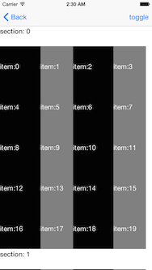

# Shelf

Shelf can display a view like AppStore for iOS. It provides like UITableViewDelegate and UITableViewDatasource about Shelf's protocol.
Shelf's base class is comprised of `UITableView`

## Features


## Installation

- Install with CocoaPods to write Podfile
```ruby
platform :ios, '8.0'
use_frameworks!

pod 'Shelf', :git => 'https://github.com/hirohisa/Shelf.git'
```

## Usage

### Set Delegate, DataSource

Shelf uses a simple methodology. It defines a delegate and a data source, its client implement.
Shelf.ViewDelegate and Shelf.ViewDataSource are like UITableViewDelegate and UITableViewDatasource.


### Cell

- Use `UICollectionViewCell`

```
shelfView.registerClass(UICollectionViewCell.self, forCellWithReuseIdentifier: "cell")
```

### Layout

### Reload

Reset cells and redisplays visible cells.

```swift
extension View {

    public func reloadData()
}
```

## Example



### ViewController

```swift

class ViewController: UIViewController {

    override func viewDidLoad() {
        super.viewDidLoad()

        let shelfView = Shelf.View(frame: frame)
        shelfView.dataSource = self
        shelfView.delegate = self
        shelfView.registerClass(UICollectionViewCell.self, forCellWithReuseIdentifier: "cell")
    }
}

extension ViewController: Shelf.ViewDataSource {

    func numberOfSectionsInShelfView(shelfView: Shelf.View) -> Int {
        return 2
    }

    func shelfView(shelfView: Shelf.View, numberOfItemsInSection section: Int) -> Int {
        return 20
    }

    func shelfView(shelfView: Shelf.View, cellForItemAtIndexPath indexPath: NSIndexPath) -> UICollectionViewCell {
        let cell = shelfView.dequeueReusableCellWithReuseIdentifier("cell", forIndexPath: indexPath) as UICollectionViewCell

        return cell
    }

}
```


## License

Shelf is available under the MIT license.
